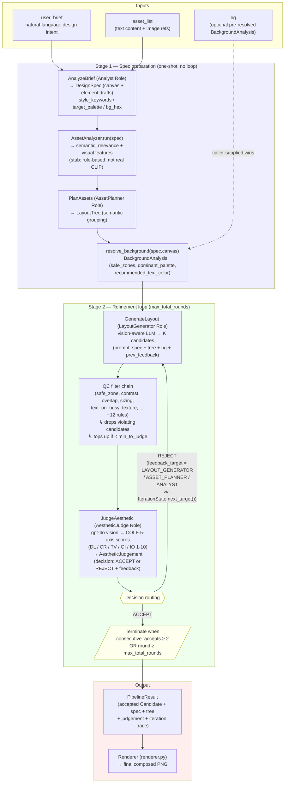

# AgentLayout Pipeline Architecture

> Paper-ready architecture figure for layout_agent. Code source of truth:
> `metagpt/ext/agentlayout/pipeline.py:LayoutPipeline.run()`.
> Date snapshot: 2026-06-15 (post-Step 70).

---

## 1. Mermaid 圖（GitHub / VS Code 直接渲染）



---

## 2. ASCII fallback（純文字版，paper 排版若不能 render Mermaid 用這個）

```
                      ┌──────────────────────────────┐
                      │  Inputs                      │
                      │  · user_brief                │
                      │  · asset_list                │
                      │  · (optional) bg             │
                      └──────────────┬───────────────┘
                                     ▼
              ┌──────────────────────────────────────────────┐
              │  Stage 1 — Spec preparation (one-shot)       │
              │                                              │
              │  ① AnalyzeBrief    (Analyst Role)            │
              │       LLM → DesignSpec + style hints         │
              │  ② AssetAnalyzer.run(spec)                   │
              │       semantic_relevance + visual features   │
              │  ③ PlanAssets      (AssetPlanner Role)       │
              │       LLM → LayoutTree                       │
              │  ④ resolve_background                        │
              │       BackgroundAnalysis (safe_zones, ...)   │
              └──────────────────────┬───────────────────────┘
                                     ▼
   ┌────────────────────────────────────────────────────────────┐
   │  Stage 2 — Refinement loop (max_total_rounds)              │
   │                                                            │
   │  ┌──────────────────────────────────────────────────────┐  │
   │  │ ⑤ GenerateLayout (LayoutGenerator Role)              │  │
   │  │     vision-aware LLM → K candidates                  │  │
   │  │     (prompt: spec + tree + bg + prev_feedback)       │  │
   │  └──────────────────────┬───────────────────────────────┘  │
   │                         ▼                                  │
   │  ┌──────────────────────────────────────────────────────┐  │
   │  │ ⑥ QC filter chain (~12 rules)                        │  │
   │  │     safe_zone / contrast / overlap / sizing /        │  │
   │  │     text_on_busy_texture / coverage / ...            │  │
   │  │     ↳ drops violating candidates                     │  │
   │  │     ↳ tops up if < min_to_judge                      │  │
   │  └──────────────────────┬───────────────────────────────┘  │
   │                         ▼                                  │
   │  ┌──────────────────────────────────────────────────────┐  │
   │  │ ⑦ JudgeAesthetic (AestheticJudge Role)               │  │
   │  │     gpt-4o vision → COLE 5-axis (DL/CR/TV/GI/IO)     │  │
   │  │     → AestheticJudgement (ACCEPT|REJECT + feedback)  │  │
   │  └──────────────────────┬───────────────────────────────┘  │
   │                         ▼                                  │
   │              ┌─────────────────────────┐                   │
   │              │ Decision routing        │                   │
   │              └───────┬────────────┬────┘                   │
   │                      │            │                        │
   │            ACCEPT    │            │  REJECT                │
   │                      ▼            ▼                        │
   │       ┌──────────────────┐   ┌──────────────────────────┐  │
   │       │ next_target =    │   │ next_target =            │  │
   │       │ LAYOUT_GENERATOR │   │ LAYOUT_GENERATOR /       │  │
   │       │ (mandatory       │   │ ASSET_PLANNER /          │  │
   │       │  refinement)     │   │ ANALYST                  │  │
   │       └────────┬─────────┘   │ (IterationState          │  │
   │                │             │  escalation)             │  │
   │                │             └────────┬─────────────────┘  │
   │                │                      │                    │
   │                └──────────┬───────────┘                    │
   │                           ▼                                │
   │              terminate when                                │
   │              consecutive_accepts ≥ 2                       │
   │              OR round ≥ max_total_rounds                   │
   │                           │                                │
   └───────────────────────────┼────────────────────────────────┘
                               ▼
                ┌──────────────────────────────┐
                │  Output                      │
                │  · PipelineResult            │
                │  · Renderer → composed PNG   │
                └──────────────────────────────┘
```

---

## 3. 5 個 Role × 7 個 Action 對應表

| Role | Action(s) | LLM 呼叫 | 輸出 |
|---|---|---|---|
| **Analyst** (`roles/analyst.py`) | `AnalyzeBrief` (`actions/analyze_brief.py`) | ✅ 1 | `DesignSpec` + style hints |
| **AssetAnalyzer** (`tools/asset_analyzer.py`) | `run(spec)` (rule-based stub) | ❌ | enriched spec (semantic_relevance + visual features) |
| **AssetPlanner** (`roles/asset_planner.py`) | `PlanAssets` (`actions/plan_assets.py`) | ✅ 1 | `LayoutTree` |
| **BackgroundAnalyzer** (`tools/background_analyzer.py`) | `resolve_background(canvas)` | ❌（CV：U2Net+BASNet 或純色 stub） | `BackgroundAnalysis` (safe_zones + palette) |
| **LayoutGenerator** (`roles/layout_generator.py`) | `GenerateLayout` (`actions/generate_layout.py`) | ✅ 多輪（每 round 1 次，K candidates） | `List[Candidate]` |
| **QualityChecker** (`tools/qc_pipeline.py`) | `filter_valid(candidates, spec, bg)` | ❌ | dropped reports + 過關 candidates |
| **AestheticJudge** (`roles/aesthetic_judge.py`) | `JudgeAesthetic` (`actions/judge_aesthetic.py`) | ✅ 1 (gpt-4o vision) | `AestheticJudgement` (5-axis scores + decision + feedback) |

> 🟡 **ComposeSketch** (`actions/compose_sketch.py`) 存在但**未接入主 pipeline**（memory
> `ComposeSketch Not Wired Into Main AgentLayout Pipeline`、僅 Step 41 oracle script 用）；論文圖
> 不畫此元件。

> 🟡 **ElementProposer** (PKU Path B 用)：本系統不存在。若要跑完整 PKU benchmark 需新增、
> 詳 `result.md` §68.3b B 段「完整跑 PKU 需新增的功能」。

---

## 4. Refinement Loop 控制流（精確語意）

`IterationState.next_target()` 決定 REJECT 時的回灌目標：

| reject_count | next_target | 意義 |
|---|---|---|
| 1 | `LAYOUT_GENERATOR` | 先 retry 同 round 給 generator |
| 2 | `LAYOUT_GENERATOR` | 仍給 generator（feedback 累積） |
| 3+ | `ASSET_PLANNER` → `ANALYST` | escalation 重新規劃資產 / 重寫 brief |

ACCEPT 時固定回 `LAYOUT_GENERATOR`（mandatory refinement，one more round），
**直到 `consecutive_accepts >= 2`** 才終止——避免單次 accept 是 noise。

`max_total_rounds` 是硬上限、`max_topup_rounds` 是 QC 過濾掉候選後 generator 補齊 K 個的子上限。

---

## 5. 證據檔

| 檔 | 內容 |
|---|---|
| `metagpt/ext/agentlayout/pipeline.py` | `LayoutPipeline.run()` 主程式（line 179） |
| `metagpt/ext/agentlayout/roles/iteration_state.py` | `IterationState.next_target()` 路由邏輯 |
| `metagpt/ext/agentlayout/actions/judge_aesthetic.py` | 5-axis COLE rubric + ACCEPT/REJECT decision |
| `metagpt/ext/agentlayout/tools/qc_pipeline.py` | `filter_valid` QC 規則鏈（Step 67 bg 參數修補後） |
| `metagpt/ext/agentlayout/tools/background_analyzer.py` | `resolve_background()` U2Net+BASNet saliency or solid-color stub |

---

*Pipeline 圖最後更新：2026-06-15。*
