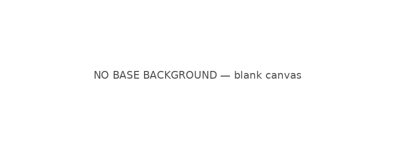
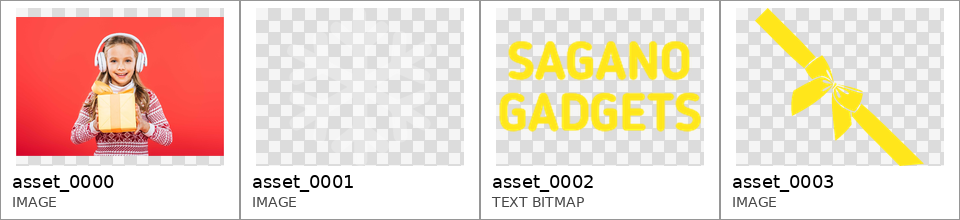
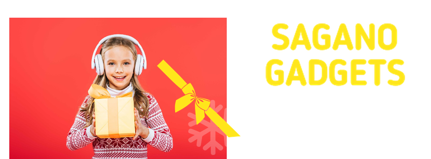
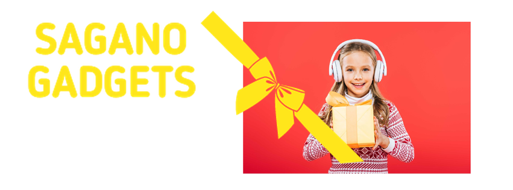

# A3 Pipeline Walkthrough — End-to-End Trace of a Single Crello Test Sample

This document traces one Crello test-set sample through every stage of the A3
architecture (T2 tree arm, L0 loop) and reproduces each intermediate artifact
verbatim, in pipeline order. All outputs below are taken unmodified from the
persisted run directory of the full Crello test batch
(`runs/a3/a3-crello-test-batch-001-n100-t2-l0-v1`); nothing was re-generated or
edited for presentation.

| Provenance | Value |
|---|---|
| Sample ID | `5f885a9aa637ee11e3498504` (Crello test split) |
| Design title | *Christmas Offer Girl in Headphones with Gift* |
| Canvas | 851 × 315 px (Facebook-cover format) |
| Foreground assets | 4 (3 raster images + 1 text bitmap) |
| Pipeline configuration | Tree arm **T2** (model-predicted layout tree), loop **L0** (single pass, no revision) |
| Model (all stages, frozen) | `gpt-5.4-mini-2026-03-17` |
| LLM calls | 7 (Analyst 1, Asset Planner 1, Composition Director 1, Coordinate Mapper 3, Internal Judge 1) |
| Total cost / wall time | $0.0301 / 22.0 s (sum of stage calls) |

Pipeline order: **Inputs → Background Analyzer → Design Spec → Layout Tree →
Composition Concepts (×3) → Coordinate Mapper (×3) → Renderer (×3) → Quality
Checker (×3) → Internal Judge (select 1 of 3)**. The Background Analyzer output
and the Design Spec are two sections of the same Analyst stage response.

---

## 1. Inputs: background, foreground assets, and user brief

### 1.1 Background

This sample has **no base background layer**: the canvas is blank white. The
deterministic vision-packet builder therefore emits an explicit placeholder
overview so the Analyst is never shown an ambiguous empty image.



### 1.2 Foreground assets

The Analyst receives the foreground assets as a uniform contact sheet. Cells
deliberately erase the original placement and scale from the source document,
so no ground-truth layout information can leak into the pipeline; the printed
labels are the stable asset IDs used by every downstream stage.



| Asset ID | Media type | Content |
|---|---|---|
| `asset_0000` | raster | Photo: girl with headphones holding a wrapped gift on a red studio background |
| `asset_0001` | raster | Faint decorative raster panel (very low contrast) |
| `asset_0002` | text bitmap | `SAGANO\nGADGETS` (yellow rounded wordmark) |
| `asset_0003` | raster | Yellow gift-ribbon/bow graphic with diagonal banding |

### 1.3 User brief

The brief is constructed deterministically from the sample's title and canvas;
the theme string is context only and must not be typeset:

> Create a 851x315 foreground layout for the theme 'Christmas Offer Girl in
> Headphones with Gift'. Use every provided placeable foreground asset exactly
> once. The theme is context, not visible copy.

---

## 2. Background Analyzer output

The Analyst stage inspects the background overview image first. Its
`background_summary` field is the background analysis passed to all downstream
stages (verbatim):

> The base canvas is completely blank white with no built-in imagery, texture,
> or color fields. Visual saliency is entirely dependent on placed foreground
> assets. Quiet regions are the full open canvas area, which can support strong
> contrast compositions. Because there is no existing palette from the
> background, the design palette should be established by the foreground
> assets, especially the vivid red product photo, the bright yellow brand text,
> and the yellow ribbon graphic.

The analyzer correctly recognizes the no-background case, declares the whole
canvas a quiet region, and redirects palette authority to the foreground
assets — a decision the Composition Director later exploits by treating white
space as deliberate retail negative space.

---

## 3. Design Spec

The remainder of the Analyst response is the Design Spec: a global design
intent, style keywords, and a per-asset semantic specification with hard usage
constraints (all verbatim).

**Design intent**

> Create a festive promotional composition for a Christmas offer using the
> supplied assets exactly once: the girl-with-gift photo as the main
> product/hero visual, the brand wordmark as the identity anchor, and the
> ribbon graphic plus the pale decorative panel as supporting holiday accents.
> Since the theme is context only and no extra copy is provided, the layout
> should feel like a clean holiday retail banner with cheerful, gift-oriented
> energy and clear brand presence.

**Style keywords** — `festive`, `retail promo`, `holiday gift`, `bright red`,
`yellow accent`, `clean banner`, `playful`, `celebratory`, `minimal background`

**Per-asset specification**

| Asset | Semantic type | Semantic role (abridged) | Constraints |
|---|---|---|---|
| `asset_0000` | `product_image` | Primary hero visual communicating the Christmas gift offer | Use exactly once as the dominant focal image; preserve the festive red photo look; do not treat as a background layer |
| `asset_0001` | `decorative_image` | Secondary atmospheric accent that softens the composition | Use exactly once; keep visually subordinate to hero and brand text; treat as subtle decorative support |
| `asset_0002` | `logo` | Brand identifier and promotional signature (`SAGANO GADGETS`) | Use exactly once; keep text fully legible and intact; do not alter wording or split the logo |
| `asset_0003` | `decorative_image` | Holiday embellishment adding motion/festive energy | Use exactly once; decorative accent only; avoid obscuring the hero subject or wordmark |

---

## 4. Layout Tree (Asset Planner, T2 arm)

The Asset Planner converts the Design Spec into a validated layout tree
(`a3.layout-tree.v1`): a semantic hierarchy (`parent_id` /
`relation_to_parent`) plus a spatial grouping (`groups`). The tree is
schema-validated before the pipeline proceeds.

```
root
├── asset_0000  product_image   [group_hero: hero_visual]           priority 0, conf 0.99
│   ├── asset_0003  decorative_image  — decorates → asset_0000
│   │                              [group_holiday_accent]           priority 2, conf 0.92
│   └── asset_0001  decorative_image  — supports  → asset_0000
│                                  [group_atmosphere]               priority 3, conf 0.84
└── asset_0002  logo            [group_brand: brand_identity]       priority 1, conf 0.98
```

Full artifact:

```json
{
  "schema_version": "a3.layout-tree.v1",
  "groups": [
    {"group_id": "group_hero",           "label": "hero_visual",         "member_ids": ["asset_0000"], "ordering_priority": 0, "confidence": 0.99},
    {"group_id": "group_brand",          "label": "brand_identity",      "member_ids": ["asset_0002"], "ordering_priority": 1, "confidence": 0.98},
    {"group_id": "group_holiday_accent", "label": "holiday_accent",      "member_ids": ["asset_0003"], "ordering_priority": 2, "confidence": 0.92},
    {"group_id": "group_atmosphere",     "label": "atmospheric_support", "member_ids": ["asset_0001"], "ordering_priority": 3, "confidence": 0.84}
  ],
  "nodes": [
    {"asset_id": "asset_0000", "parent_id": "root",       "relation_to_parent": "root",      "semantic_type": "product_image",    "group_id": "group_hero",           "ordering_priority": 0, "confidence": 0.99},
    {"asset_id": "asset_0002", "parent_id": "root",       "relation_to_parent": "root",      "semantic_type": "logo",             "group_id": "group_brand",          "ordering_priority": 1, "confidence": 0.98},
    {"asset_id": "asset_0003", "parent_id": "asset_0000", "relation_to_parent": "decorates", "semantic_type": "decorative_image", "group_id": "group_holiday_accent", "ordering_priority": 2, "confidence": 0.92},
    {"asset_id": "asset_0001", "parent_id": "asset_0000", "relation_to_parent": "supports",  "semantic_type": "decorative_image", "group_id": "group_atmosphere",     "ordering_priority": 3, "confidence": 0.84}
  ]
}
```

The tree captures the intended dependency structure: both decorative assets
serve the hero photo (`decorates` / `supports`), while the logo is an
independent top-level anchor.

---

## 5. Composition Concepts (Composition Director, ×3)

Conditioned on the Design Spec and the layout tree, the Composition Director
proposes three intentionally diverse composition concepts
(`a3.concept-set.v1`). Each concept later drives exactly one Coordinate Mapper
call.

### Concept 1 — "Left Hero Banner"

| Field | Value |
|---|---|
| Focal element | `asset_0000` |
| Focal placement | Place the girl-with-gift photo large in the left half of the canvas, slightly weighted toward the center so the red studio image reads as the main hero block without touching the edges too tightly. |
| Text placement | Set the SAGANO GADGETS wordmark in the upper-right area, clearly separated from the hero image and held as a clean brand anchor against the white space. |
| Text↔photo relation | `beside` (`asset_0002` → top-right) |
| Visual flow | The eye enters on the bold red hero at left, moves diagonally upward to the yellow wordmark at right, then catches the holiday ribbon as a linking accent across the hero edge. |
| Whitespace | Keep the right half mostly open and airy so the logo has room to breathe; let the blank white canvas function as premium retail negative space. |

### Concept 2 — "Right Split Feature"

| Field | Value |
|---|---|
| Focal element | `asset_0000` |
| Focal placement | Place the girl-with-gift photo on the right side of the banner, with the red image acting like a strong feature panel that slightly overlaps the visual center. |
| Text placement | Position the SAGANO GADGETS wordmark in the upper-left region, making the brand read first before the eye lands on the hero image. |
| Text↔photo relation | `beside` (`asset_0002` → top-left) |
| Visual flow | The composition should read left-to-right: brand first, then a short cross-canvas move into the hero, with the ribbon adding a festive sweep that reinforces the transition. |
| Whitespace | Leave generous open space beneath the logo and around the left side so the layout feels breathable and modern rather than crowded. |

### Concept 3 — "Center Pop Layout"

| Field | Value |
|---|---|
| Focal element | `asset_0000` |
| Focal placement | Place the girl-with-gift photo near the center-left, large enough to dominate the middle band of the banner while still leaving a strong open margin on one side. |
| Text placement | Set the SAGANO GADGETS wordmark in the lower-right area, turning it into a signature tag that anchors the composition without competing with the hero face. |
| Text↔photo relation | `below` (`asset_0002` → bottom-right) |
| Visual flow | The viewer meets the central hero first, then drops toward the lower-right brand signature, while the ribbon can arc around the hero to create a gentle festive loop. |
| Whitespace | Preserve broad white margins on the top and one outer side so the hero feels spotlighted and the banner retains a polished, minimal retail feel. |

---

## 6. Coordinate Mapper output (×3)

Each concept is compiled independently into absolute pixel coordinates on the
851 × 315 canvas (one Coordinate Mapper call per concept; elements listed in
z-order).

### Candidate 1 ← Concept "Left Hero Banner"

| Element | left | top | width | height | z | Typography |
|---|---:|---:|---:|---:|---:|---|
| `asset_0000` (hero photo) | 18 | 35 | 430 | 287 | 1 | — |
| `asset_0001` (soft panel) | 370 | 198 | 100 | 109 | 1 | — |
| `asset_0003` (ribbon) | 310 | 118 | 165 | 154 | 2 | — |
| `asset_0002` (wordmark) | 520 | 42 | 284 | 133 | 3 | Arial 58 px, weight 700, `#F2D21B`, left-aligned |

### Candidate 2 ← Concept "Right Split Feature"

| Element | left | top | width | height | z | Typography |
|---|---:|---:|---:|---:|---:|---|
| `asset_0001` (soft panel) | 610 | 74 | 120 | 131 | 1 | — |
| `asset_0000` (hero photo) | 403 | 36 | 378 | 252 | 2 | — |
| `asset_0002` (wordmark) | 42 | 33 | 288 | 134 | 3 | rendered as supplied text bitmap |
| `asset_0003` (ribbon) | 333 | 18 | 271 | 253 | 4 | — |

### Candidate 3 ← Concept "Center Pop Layout"

| Element | left | top | width | height | z | Typography |
|---|---:|---:|---:|---:|---:|---|
| `asset_0001` (soft panel) | 472 | 28 | 250 | 273 | 1 | — |
| `asset_0003` (ribbon) | 318 | 14 | 188 | 175 | 2 | — |
| `asset_0000` (hero photo) | 84 | 50 | 340 | 227 | 3 | — |
| `asset_0002` (wordmark) | 509 | 231 | 300 | 140 | 4 | Arial 48 px, bold, `#F4C542`, left-aligned |

All rotations are 0°. Each candidate places all four assets exactly once, as
required by the Design Spec constraints.

---

## 7. Quality Checker results

The deterministic Quality Checker validates every candidate against the Design
Spec and the geometric/typographic rule set. Completeness is the fraction of
required assets actually placed.

| Candidate | Completeness | Passed | Violations |
|---|---:|:---:|---|
| `r0_candidate_01` | 1.0 | ✗ | `out_of_bounds: top+height=322 > canvas.height=315` |
| `r0_candidate_02` | 1.0 | **✓** | *(none)* |
| `r0_candidate_03` | 1.0 | ✗ | `out_of_bounds: top+height=371 > canvas.height=315` |

Candidates 1 and 3 each let one element overrun the bottom canvas edge
(candidate 1: the hero photo by 7 px; candidate 3: the wordmark by 56 px).
Candidate 2 is fully compliant. QC verdicts are attached to the candidate
bundle that accompanies the render set.

---

## 8. The three rendered candidates

### Candidate 1 — "Left Hero Banner" (QC: 1 violation)



### Candidate 2 — "Right Split Feature" (QC: pass)



### Candidate 3 — "Center Pop Layout" (QC: 1 violation)


---

## 9. Internal Judge: final selection

Judge-Select receives the three rendered candidates as images (attachment
order matching the candidate list) and must produce a strict ranking with
exactly one winner (`a3.judge-select-result.v1`):

```json
{
  "schema_version": "a3.judge-select-result.v1",
  "ranking": ["r0_candidate_02", "r0_candidate_01", "r0_candidate_03"],
  "selected_candidate_id": "r0_candidate_02"
}
```

**Final output: `r0_candidate_02` ("Right Split Feature").** The judge's
visual ranking independently agrees with the Quality Checker: the only
QC-clean candidate is ranked first, while candidate 3 — whose wordmark is
visibly clipped at the bottom edge — is ranked last. The L0 loop then stops
(`stop_reason: l0_unconditional_stop`) and candidate 2 is emitted as the final
design.

---

## Appendix: per-stage cost and latency

| Stage | Calls | Prompt tokens | Completion tokens | Cost (USD) | Time (s) |
|---|---:|---:|---:|---:|---:|
| Analyst (Background Analyzer + Design Spec) | 1 | 1,707 | 640 | 0.0042 | 6.1 |
| Asset Planner (Layout Tree) | 1 | 2,045 | 456 | 0.0036 | 3.1 |
| Composition Director (3 concepts) | 1 | 2,729 | 648 | 0.0050 | 5.5 |
| Coordinate Mapper | 3 | 7,178 | 576 | 0.0080 | 5.7 |
| Internal Judge (select) | 1 | 1,616 | 47 | 0.0014 | 1.6 |
| **Total** | **7** | **15,275** | **2,367** | **$0.0301** | **22.0** |

Renderer and Quality Checker are deterministic (no LLM calls, no cost).
