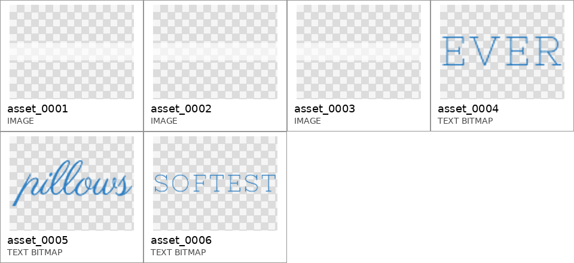

# A3 Pipeline Walkthrough #2 — Sample with a Real Photographic Background and a Non-Trivial Layout Tree

This is the companion walkthrough to `A3_PIPELINE_WALKTHROUGH.md`. The first
document traced a blank-canvas sample; this one traces a sample chosen to
exercise the remaining structural features of the A3 architecture:

1. a **real background image** (not blank, not a solid fill),
2. a background with a **recognizable subject and quiet/whitespace regions**,
3. a layout tree with **at least one group containing two or more assets**, and
4. explicit **parent–child dependencies** between assets.

As before, every output is reproduced verbatim from the persisted run
directory of the full Crello test batch
(`runs/a3/a3-crello-test-batch-001-n100-t2-l0-v1`); nothing was re-generated
or edited for presentation.

| Provenance | Value |
|---|---|
| Sample ID | `58ac638c95a7a863ddcc7c2b` (Crello test split) |
| Design title | *Softest Pillows Ad with Tender Dandelion Seeds* |
| Canvas | 600 × 200 px (leaderboard-banner format) |
| Background | Real photographic background (`asset_0000`, macro dandelion seed heads) |
| Foreground assets | 6 (3 raster decorative panels + 3 text bitmaps) |
| Pipeline configuration | Tree arm **T2** (model-predicted layout tree), loop **L0** (single pass, no revision) |
| Model (all stages, frozen) | `gpt-5.4-mini-2026-03-17` |
| LLM calls | 7 (Analyst 1, Asset Planner 1, Composition Director 1, Coordinate Mapper 3, Internal Judge 1) |
| Total cost / wall time | $0.0252 / 27.1 s (sum of stage calls) |

Pipeline order: **Inputs → Background Analyzer → Design Spec → Layout Tree →
Composition Concepts (×3) → Coordinate Mapper (×3) → Renderer (×3) → Quality
Checker (×3) → Internal Judge (select 1 of 3)**. The Background Analyzer output
and the Design Spec are two sections of the same Analyst stage response.

---

## 1. Inputs: background, foreground assets, and user brief

### 1.1 Background

Unlike the first walkthrough sample, this design ships with a genuine
photographic base layer: a macro shot of dandelion seed heads. The image has a
clearly recognizable subject (the large central and right seed heads with
radiating filaments) and naturally quiet regions (the washed-out, bokeh-soft
left and lower-left area) — exactly the structure the Background Analyzer is
designed to characterize.


### 1.2 Foreground assets

The Analyst receives the six placeable foreground assets as a uniform contact
sheet (original placement and scale deliberately erased; printed labels are
the stable asset IDs):



| Asset ID | Media type | Content |
|---|---|---|
| `asset_0001` | raster | Translucent pale horizontal panel (soft texture strip) |
| `asset_0002` | raster | Translucent pale horizontal panel (soft texture strip) |
| `asset_0003` | raster | Translucent pale horizontal panel (soft texture strip) |
| `asset_0004` | text bitmap | `EVER` (slender blue serif) |
| `asset_0005` | text bitmap | `pillows` (flowing blue script) |
| `asset_0006` | text bitmap | `SOFTEST` (pale blue serif, uppercase) |

### 1.3 User brief

> Create a 600x200 foreground layout for the theme 'Softest Pillows Ad with
> Tender Dandelion Seeds'. Use every provided placeable foreground asset
> exactly once. The theme is context, not visible copy.

---

## 2. Background Analyzer output

The Analyst's `background_summary` for the photographic background (verbatim):

> The background is a soft, airy macro-style botanical scene with pale beige
> dandelion seed heads and fine filaments against a bright, washed-out cream
> and sky-tinted backdrop. Saliency is low and diffuse, with the central seed
> head and thin radiating strands providing the main visual focus while the
> edges stay quiet and atmospheric. The palette is restrained and tender:
> ivory, warm beige, light tan, faint gold-brown, and hints of icy blue in the
> blur.

Three properties of this analysis matter downstream: it identifies the **main
subject** (central seed head and filaments), the **quiet regions** (edges),
and the **background palette** (ivory/beige/icy blue) — which the Composition
Director converts into edge-biased text placement and the Coordinate Mapper
converts into soft blue typography that harmonizes with the backdrop.

---

## 3. Design Spec

**Design intent**

> Create a gentle luxury ad composition that feels like the softness of a
> pillow and the delicacy of dandelion fluff. The foreground should read as a
> light, elegant typographic arrangement paired with subtle decorative
> imagery, reinforcing tenderness, comfort, and airy softness without adding
> new copy beyond the provided words.

**Style keywords** — `soft`, `airy`, `minimal`, `gentle`, `pastel`, `luxury`,
`botanical`, `delicate`, `dreamy`, `clean`

**Per-asset specification**

| Asset | Semantic type | Semantic role | Constraints |
|---|---|---|---|
| `asset_0001` | `decorative_image` | Supporting decorative texture that amplifies delicacy and lightness | Use exactly once as a foreground decorative element; keep visually subordinate to typography; do not treat as a background image |
| `asset_0002` | `decorative_image` | Supporting decorative texture for softness and depth | Use exactly once; keep subtle and non-dominant |
| `asset_0003` | `decorative_image` | Supporting decorative texture that adds calm visual breathing room | Use exactly once; maintain a quiet, delicate presence |
| `asset_0004` | `subtitle` | Typographic word fragment contributing to the phrase structure and rhythmic emphasis (`EVER`) | Use exactly once as provided; preserve text content exactly; treat as typographic element, not a logo |
| `asset_0005` | `title` | Primary product-themed headline fragment conveying comfort and plushness (`pillows`) | Use exactly once; preserve the lowercase content exactly; keep the script prominent and tender |
| `asset_0006` | `title` | Main headline word emphasizing extreme softness and setting the emotional tone (`SOFTEST`) | Use exactly once; preserve the uppercase content exactly; central soft-selling message |

Note how the Analyst recovers the intended **reading phrase** from three
separate text bitmaps: `SOFTEST` + `pillows` + `EVER`.

---

## 4. Layout Tree (Asset Planner, T2 arm)

This sample is the reason it was selected: the predicted tree contains **two
multi-member groups** (three assets each) and a **three-level parent–child
chain**, rather than the flat two-singleton structure of simpler samples.

```
root
└── asset_0006  "SOFTEST"  title      [group_typography_main]   prio 0, conf 0.98
    ├── asset_0005  "pillows"  title     — sequence_after → asset_0006   prio 1, conf 0.95
    │   └── asset_0004  "EVER"  subtitle — sequence_after → asset_0005   prio 2, conf 0.93
    ├── asset_0001  decorative_image     — decorates      → asset_0006   prio 3, conf 0.92
    ├── asset_0002  decorative_image     — decorates      → asset_0006   prio 4, conf 0.91
    └── asset_0003  decorative_image     — decorates      → asset_0006   prio 5, conf 0.91
```

Two structural facts to highlight for the paper:

- **Multi-member groups.** `group_typography_main` ("Main Headline Cluster",
  confidence 0.98) binds `asset_0006`, `asset_0005`, `asset_0004`;
  `group_decorative_soft` ("Soft Atmospheric Decoration", confidence 0.93)
  binds the three texture panels. Group membership tells the mapper which
  elements must be laid out as coherent clusters.
- **Parent–child dependencies.** The `sequence_after` chain
  `SOFTEST → pillows → EVER` encodes the reading order of the three-word
  phrase, and all three decorative panels attach to the headline via
  `decorates` — five non-root edges in total.

Full artifact:

```json
{
  "schema_version": "a3.layout-tree.v1",
  "root_label": "foreground_layout",
  "source": "predicted",
  "groups": [
    {"group_id": "group_typography_main", "label": "Main Headline Cluster",       "member_ids": ["asset_0006", "asset_0005", "asset_0004"], "ordering_priority": 0, "confidence": 0.98},
    {"group_id": "group_decorative_soft", "label": "Soft Atmospheric Decoration", "member_ids": ["asset_0001", "asset_0002", "asset_0003"], "ordering_priority": 1, "confidence": 0.93}
  ],
  "nodes": [
    {"asset_id": "asset_0006", "parent_id": "root",       "relation_to_parent": "root",           "semantic_type": "title",            "group_id": "group_typography_main", "ordering_priority": 0, "confidence": 0.98},
    {"asset_id": "asset_0005", "parent_id": "asset_0006", "relation_to_parent": "sequence_after", "semantic_type": "title",            "group_id": "group_typography_main", "ordering_priority": 1, "confidence": 0.95},
    {"asset_id": "asset_0004", "parent_id": "asset_0005", "relation_to_parent": "sequence_after", "semantic_type": "subtitle",         "group_id": "group_typography_main", "ordering_priority": 2, "confidence": 0.93},
    {"asset_id": "asset_0001", "parent_id": "asset_0006", "relation_to_parent": "decorates",      "semantic_type": "decorative_image", "group_id": "group_decorative_soft", "ordering_priority": 3, "confidence": 0.92},
    {"asset_id": "asset_0002", "parent_id": "asset_0006", "relation_to_parent": "decorates",      "semantic_type": "decorative_image", "group_id": "group_decorative_soft", "ordering_priority": 4, "confidence": 0.91},
    {"asset_id": "asset_0003", "parent_id": "asset_0006", "relation_to_parent": "decorates",      "semantic_type": "decorative_image", "group_id": "group_decorative_soft", "ordering_priority": 5, "confidence": 0.91}
  ]
}
```

---

## 5. Composition Concepts (Composition Director, ×3)

### Concept 1 — "Left Air Drift"

| Field | Value |
|---|---|
| Focal element | `asset_0006` ("SOFTEST") |
| Focal placement | Place the main headline word as a calm anchor in the left-center portion of the canvas, letting it read first against the softer open area. |
| Text placement | Stack the remaining typography nearby in a compact vertical cluster that stays on the left half, with the script word flowing beneath the serif headline and the slender subtitle finishing close by. |
| Text↔photo relation | `beside` (all three words → left-center) |
| Visual flow | The eye enters from the bright left edge, settles on the headline cluster, then drifts gently toward the airy botanical detail toward the middle and right. |
| Whitespace | Preserve generous open space on the right side so the dandelion background can breathe and the ad feels featherlight. |

Note that the Director places the whole text cluster in the **left-center
open area** — the quiet region the Background Analyzer identified — leaving
the recognizable seed heads unobstructed.

### Concept 2 — "Center Overlap Bloom"

| Field | Value |
|---|---|
| Focal element | `asset_0005` ("pillows") |
| Focal placement | Let the flowing script word sit across the central zone as the most expressive element, lightly overlapping the soft botanical atmosphere without overpowering it. |
| Text placement | Arrange the serif headline above and the slender subtitle just below or adjacent, forming a compact central stack that feels like a luxury label suspended in air. |
| Text↔photo relation | `overlay` (all three words → center) |
| Visual flow | The eye lands in the center, reads the stacked words top to bottom, and then gently registers the surrounding seed-head filaments as a halo of softness. |
| Whitespace | Keep the outer edges especially quiet so the center feels floated and luminous, with negative space acting like a cushion around the type. |

### Concept 3 — "Right Edge Serenity"

| Field | Value |
|---|---|
| Focal element | `asset_0004` ("EVER") |
| Focal placement | Place the slender subtitle word as a refined accent near the upper-right area, allowing it to act like a quiet finishing note against the pale backdrop. |
| Text placement | Set the main headline and script word lower and slightly left of it, creating a stepped arrangement that stretches diagonally across the right half of the canvas. |
| Text↔photo relation | `above` (`asset_0004` → upper-right; `asset_0005`, `asset_0006` → lower-right) |
| Visual flow | The viewer reads from the larger words in the lower-left-to-center zone upward toward the smaller subtitle near the upper-right, mirroring the lightness of drifting seed fluff. |
| Whitespace | Leave a broad expanse of calm space on the left and upper center so the composition feels airy, expensive, and uncluttered. |

---

## 6. Coordinate Mapper output (×3)

Absolute pixel coordinates on the 600 × 200 canvas (elements in z-order; all
rotations 0°; each candidate places all six foreground assets exactly once).

### Candidate 1 ← Concept "Left Air Drift"

| Element | left | top | width | height | z | Typography |
|---|---:|---:|---:|---:|---:|---|
| `asset_0001` (panel) | 235 | 18 | 142 | 19 | 1 | — |
| `asset_0002` (panel) | 404 | 6 | 151 | 21 | 1 | — |
| `asset_0003` (panel) | 482 | 52 | 96 | 13 | 1 | — |
| `asset_0006` "SOFTEST" | 48 | 46 | 173 | 31 | 3 | serif 28 px, regular, `#BFD9EA` |
| `asset_0005` "pillows" | 62 | 79 | 128 | 51 | 4 | script 34 px, regular, `#D7EAF5` |
| `asset_0004` "EVER" | 56 | 132 | 148 | 41 | 5 | sans-serif 24 px, weight 300, `#DCEAF4` |

The `sequence_after` chain from the layout tree materializes as a top-to-bottom
stack at nearly identical x-positions (48/62/56): the phrase reads
SOFTEST → pillows → EVER in order.

### Candidate 2 ← Concept "Center Overlap Bloom"

| Element | left | top | width | height | z | Typography |
|---|---:|---:|---:|---:|---:|---|
| `asset_0001` (panel) | 12 | 8 | 120 | 16 | 1 | — |
| `asset_0002` (panel) | 436 | 6 | 132 | 18 | 1 | — |
| `asset_0003` (panel) | 215 | 148 | 170 | 23 | 1 | — |
| `asset_0006` "SOFTEST" | 150 | 70 | 300 | 54 | 3 | serif 46 px, weight 300, `#7AA7C7`, centered |
| `asset_0005` "pillows" | 167 | 89 | 266 | 106 | 4 | cursive 56 px, weight 400, `#8FB8D8`, centered |
| `asset_0004` "EVER" | 195 | 152 | 210 | 58 | 5 | serif 32 px, weight 300, `#9AB8D0`, centered |

### Candidate 3 ← Concept "Right Edge Serenity"

| Element | left | top | width | height | z | Typography |
|---|---:|---:|---:|---:|---:|---|
| `asset_0001` (panel) | 17 | 10 | 154 | 21 | 1 | — |
| `asset_0002` (panel) | 70 | 2 | 130 | 18 | 1 | — |
| `asset_0003` (panel) | 0 | 78 | 146 | 20 | 1 | — |
| `asset_0006` "SOFTEST" | 306 | 120 | 188 | 34 | 3 | serif 30 px, regular, `#5E86A8` |
| `asset_0005` "pillows" | 381 | 151 | 172 | 69 | 4 | script 42 px, regular, `#6D97B8` |
| `asset_0004` "EVER" | 468 | 64 | 98 | 27 | 5 | serif 22 px, weight 300, `#86A8C3` |

---

## 7. Quality Checker results

| Candidate | Completeness | Passed | Violations |
|---|---:|:---:|---|
| `r0_candidate_01` | 1.0 | ✗ | `missing_element: asset_0000`†; `low_text_contrast` on `asset_0004/0005/0006` vs `canvas_bg=#FFFFFF`† |
| `r0_candidate_02` | 1.0 | ✗ | `missing_element: asset_0000`†; **`out_of_bounds: top+height=210 > canvas.height=200`**; `low_text_contrast` ×3† |
| `r0_candidate_03` | 1.0 | ✗ | `missing_element: asset_0000`†; **`out_of_bounds: top+height=220 > canvas.height=200`**; **`title_peripheral: title 'asset_0005' center_y=0.93 > 0.85`**; `low_text_contrast` ×3† |

† **Protocol artifacts on background-bearing samples (honest disclosure).**
Two violation classes fire on *every* candidate of *every* sample that has a
real background asset, and carry no discriminative signal in this QC version:
(a) `missing_element: asset_0000` — the background layer is composited by the
renderer, never placed by the Coordinate Mapper, but the checker still scans
the DesignSpec asset list; (b) `low_text_contrast … vs canvas_bg=#FFFFFF` —
the contrast rule tests against a default white canvas rather than the actual
photographic background (the pale-blue-on-white readings of 1.2–3.9 do not
describe the rendered result, where the same text sits on darker botanical
imagery).

The **discriminating** violations are highlighted in bold: candidate 2's
"EVER" block overruns the bottom edge by 10 px, and candidate 3 both overruns
by 20 px and drops the "pillows" title into the peripheral zone
(center_y = 0.93). Candidate 1 carries only the two artifact classes.

Because no candidate formally passed, the bundle records the degradation
`all_qc_failed`, and per L0 policy the Internal Judge still selects among all
three candidates.

---

## 8. The three rendered candidates

### Candidate 1 — "Left Air Drift" (QC: protocol artifacts only)


### Candidate 2 — "Center Overlap Bloom" (QC: out-of-bounds)


### Candidate 3 — "Right Edge Serenity" (QC: out-of-bounds + peripheral title)


---

## 9. Internal Judge: final selection

```json
{
  "schema_version": "a3.judge-select-result.v1",
  "ranking": ["r0_candidate_01", "r0_candidate_03", "r0_candidate_02"],
  "selected_candidate_id": "r0_candidate_01"
}
```

**Final output: `r0_candidate_01` ("Left Air Drift").** The judge — which sees
only the rendered images — ranks first the one candidate whose only QC entries
are the two protocol artifact classes, and ranks last candidate 2, whose
centered script overlaps the headline and whose subtitle is clipped at the
bottom edge. The selection also validates the whole chain of upstream
decisions on this sample: the Background Analyzer's quiet-region reading (left
edge), the Director's Concept 1 placement into that region, and the Mapper's
vertical realization of the `SOFTEST → pillows → EVER` sequence chain all
survive intact in the winning render, with the dandelion subject left fully
visible. The L0 loop then stops (`stop_reason: l0_unconditional_stop`).

---

## Appendix: per-stage cost and latency

| Stage | Calls | Prompt tokens | Completion tokens | Cost (USD) | Time (s) |
|---|---:|---:|---:|---:|---:|
| Analyst (Background Analyzer + Design Spec) | 1 | 1,946 | 761 | 0.0049 | 7.4 |
| Asset Planner (Layout Tree) | 1 | 2,214 | 549 | 0.0041 | 3.6 |
| Composition Director (3 concepts) | 1 | 2,946 | 664 | 0.0052 | 6.1 |
| Coordinate Mapper | 3 | 7,581 | 881 | 0.0097 | 8.0 |
| Internal Judge (select) | 1 | 1,568 | 41 | 0.0014 | 2.1 |
| **Total** | **7** | **16,255** | **2,896** | **$0.0252** | **27.1** |

Renderer and Quality Checker are deterministic (no LLM calls, no cost).
